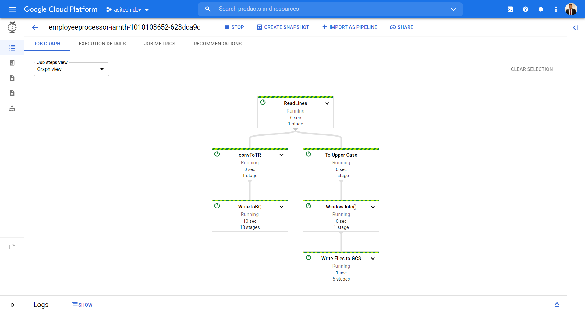

# Employee Processor Dataflow Job

## A simple dataflow job to demonstrate PubSub to BQ and GCS



## Dataflow Runner instructions

```shell
mvn compile exec:java -Dexec.mainClass=cloud.asitech.dataflow.employee.pipeline.EmployeeProcessor \
     -Dexec.args="--runner=DataflowRunner --project=asitech-dev \
                  --region=us-east1 \
                  --gcpTempLocation=gs://data-flow-asitech/tmp \
                  --tempLocation=gs://data-flow-asitech/bq/tmp \
                  --serviceAccount=dataflow-processor-sa@asitech-dev.iam.gserviceaccount.com \
                  --inputTopic=projects/asitech-dev/topics/employee-topic --output=gs://data-flow-asitech/employee \
                  --tableDetail=asitech-dev:employee_info.employee_details" \
     -Pdataflow-runner
```


## Example XML

```xml
<?xml version="1.0" encoding="UTF-8"?>
<employee>
   <name>Mr John Test</name>
   <email>test@abc.com</email>
   <country>GB</country>
</employee>
```
